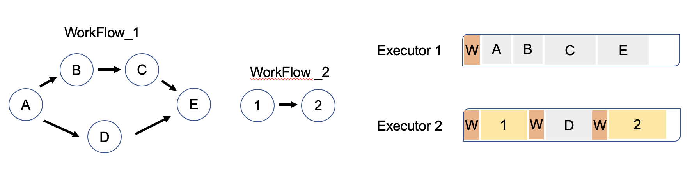

# Cloud-Native-Scheduling

> **Objective** : Develop a mathematical model for solving the cloud-native assembly scheduling problem 

** Main Challenge : dealing with large-scale cases
** Employ the LR approach to decompose the problem into subproblems, solve by heuristic approach

### Goal : provides an effective approach to the cload-native assembly scheduling problem, where traditional methods struggle due to the complexity and scale of the problem 

## Contents

## Data Source 

* Generate by a 'Workflow Generator' (perviously introduced in the Cloud-Native workflow paper)

- Creates sample workflows by setting multiple parameters (width, depth, max children per node, etc.)
- Use Tree-structured graph networks to represent precedence relations 
- Set the data to include only one work center 
- Vertex : Operation / Edges : precedence dependencies among operations 

## FrameWork 

### 1. Cloud-native Assembly Sceduling Problem Formulation

* Determine operation processing priority to minimize total makespan of workflows 

* Warm-up cost : time/resources to prepare an executor for running an operation 

#### Constraints 

1. Constraints-1 : Warm-up cost should be added to finish time of predecessor operation i 
2. Constraints-2 : Each operation must be assigned to exactly one executor 

#### Decision Variables 

* ``𝜓_𝑗𝑖``Boolean components, 1 if O_j precedes O_i on some executor otherwise 0 
* ``𝜙_𝑗𝑦``Boolean components, 1 if O_j processed on the y_th executor otherwise 0 
* ``𝜒_𝑖𝑗 ``Boolean components, 1 if O_i is child of O_j otherwise 0 
* ``WC[i][j]``Boolean components, 1 if warm-up time is required between O_i and O_j otherwise 0

#### Objective Function

### 2. Linear Regression and Heuristic Approach 

* relax the problem to scheduling multiple workflows to one workflow
* Divide one workflow to sub-workflows and prioritize each operation of sub-workflos

* Objective function of the relaxed problem's optimal solution serves as a lower bound for the original problem

## References
* Jungeun Shin (2022). Cloud-native Workflow Scheduling using a Hybrid Priority Rule and Dynamic Task Parallelism
* Jinyang Xu & Rakesh Nagi. (2012). Solving Assembly Scheduling Problems With Tree-Structure Precedence Constraints: A Lagrangian Relaxation Approach
* Yi, W., Ye, X., Shigang, C. (2017). Using Integer Programming for Workflow Scheduling in the Cloud
* Sachin, M., Simin, H., Rakesh, N. (2012). Scheduling to minimize stringer utilization for continuous annealing operations.
* Muhammad, A., Rakesh, N. (2011). Integrated lot sizing and scheduling for just-in-time production of Complex Assemblies with Finite Set-ups.
* Muhammad, A., Rakesh, N. (2013). Integrated Scheduling of Material Handling and Manufacturing Activities for Just-In-Time Production of Complex Assemblies
